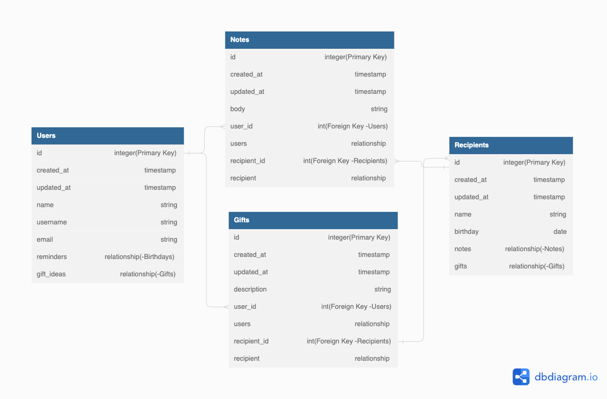
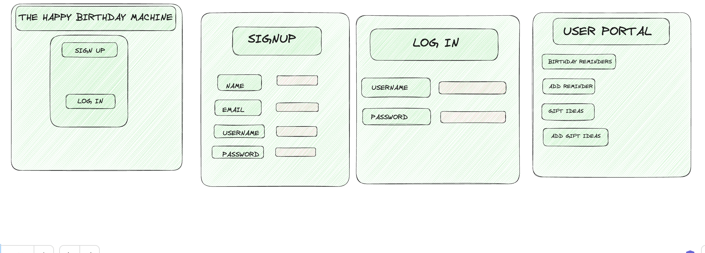
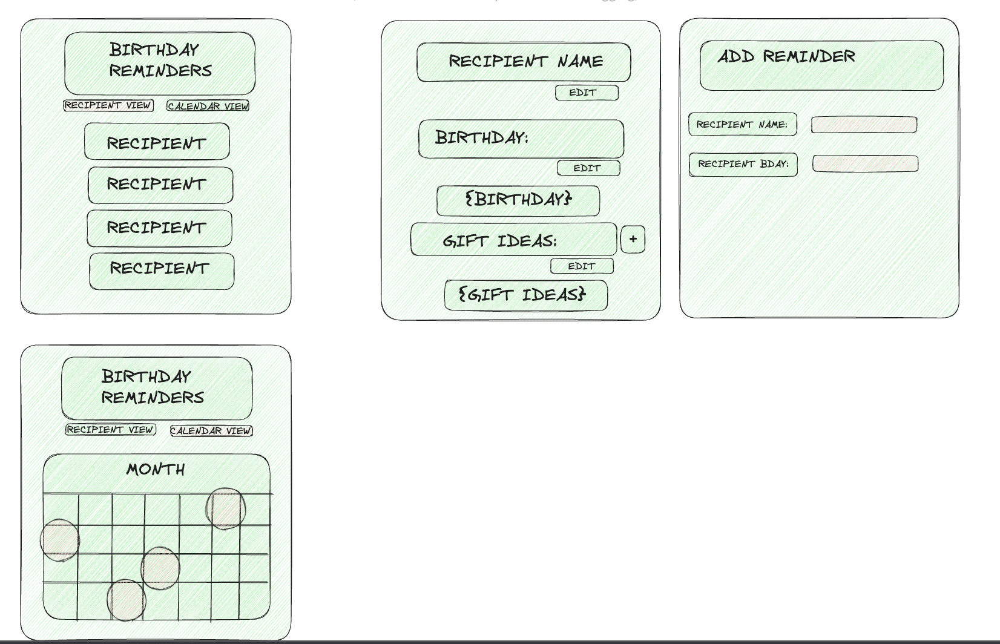
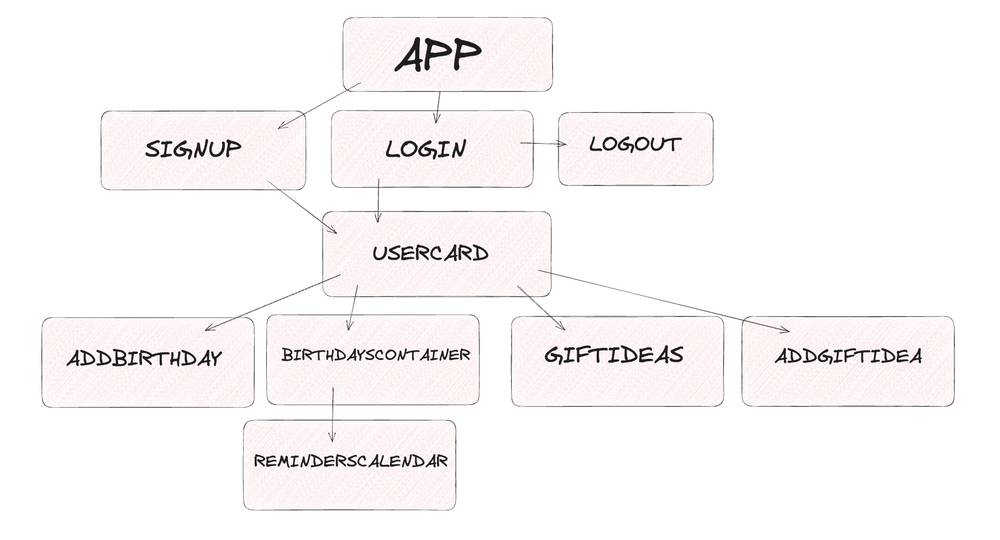

<h4>THE HAPPY BIRTHDAY MACHINE</h4>

Users will be ables to...
1. Sign up and login to their profile
2. Save birthday reminders of friends and loved ones
3. View reminders by birthday recipient's name or by calendar date
4. Keep notes on gift ideas for individual birthday recipient
5. Edit their profile and reminders
6. Recieve email reminders of birthday reminders

##SCHEMA

##WIREFRAMES

##TRELLO BOARD

##REACT-TREE

##API ROUTES
| API Routes            | Method | Body                                        | Response                                                               |
|-----------------------|--------|---------------------------------------------|------------------------------------------------------------------------|
| /signup               | POST   | "Name:  Email:  Username:  Password:"       | "Name:{name}  Email:{email}  Username:{username}  Password:{password}" |
| /login                | POST   | "Username:{username}  Password:{password}"  | "Welcome, {username}!"  {username, password}                           |
| /logout               | DELETE | "{user_id}"                                 | "{}"                                                                   |
| /users/{username}     | GET    |                                             | "User Portal:  Basic Info  Reminders List  Gift Ideas List"            |
| /users/{username}     | PATCH  | "Name:  Username:  Email:"                  | "Name:{name},  Username:{username},  Email:{email}"                    |
| /birthdays/{user_id}  | GET    |                                             | "{user_id.reminders}"                                                  |
| /birthdays/{user_id}  | POST   | "{recipients.name},  {birthdays.date}       | "{recipients.name}, {recipients.birthday}"                             |
| /birthdays/{user_id}  | PATCH  | "{recipients.name},  {birthdays.date}"      | "{recipients.name}, {recipients.birthday}"                             |
| /birthdays/{user_id}  | DELETE | "users.reminder"                            | "{}"                                                                   |
| /gift_ideas/{user_id} | GET    |                                             | "{user_id.gift_ideas}"                                                 |
| /gift_ideas/{user_id} | POST   | "{recipient_id.name},  {gifts.description}" | "{recipient_id.name},  {gifts.description}"                            |
| /gift_ideas/{user_id} | PATCH  | "{recipient_id.name},  {gifts.description}" | "{recipient_id.name},  {gifts.description}"                            |
| /gift_ideas/{user_id} | DELETE | "{users.gift_ideas}                         | "{}"                                                                   |

##CLIENT SIDE ROUTES
| CLIENT SIDE ROUTES | COMPONENTS         |
|--------------------|--------------------|
| /Home              | SignUp, LogIn      |
| /SignUp            | SignUp             |
| /LogIn             | LogIn              |
| /users/{username}  | UserCard           |
| /recipients        | BirthdaysContainer |
| /calendar          | BirthdaysCalendar  |
| /birthdays/add     | AddBirthday        |
| /gifts             | GiftIdeas          |
| /gifts/add         | AddGiftIdea        |
| /LogOut            | LogIn              |